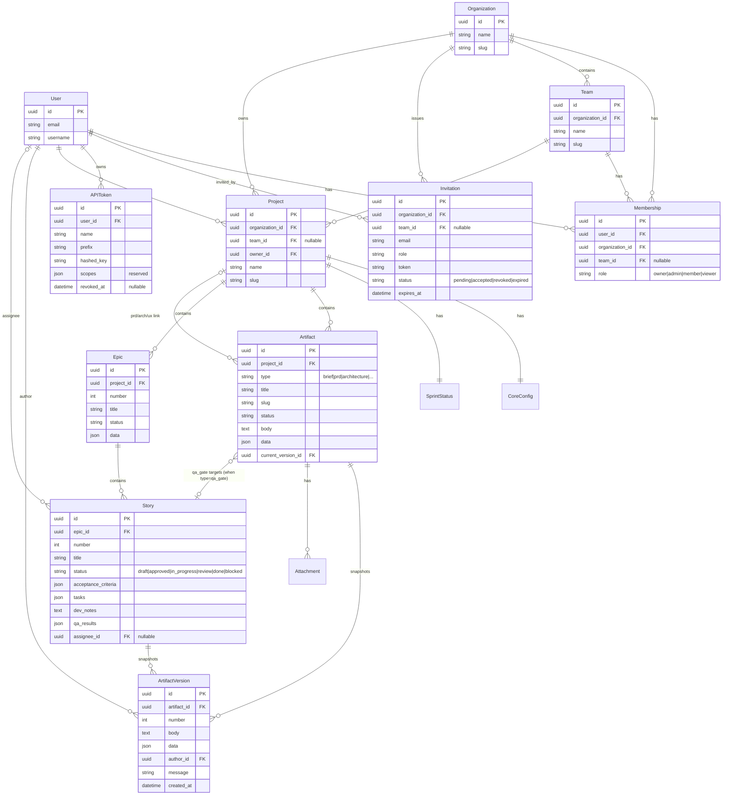

# Data Model — ER Diagram

The model graph behind the platform. Tenant scoping flows from `Organization` down;
every artifact resolves to an org (and optionally a team + owner) for access control.

## Notes

- **PKs are UUIDs** — opaque ids are friendlier for a multi-tenant REST API and the CLI.
- **`Artifact.data`** holds type-specific structure (see `DATA_SCHEMAS.md`); `Epic` and
  `Story` are promoted out of the generic `Artifact` table because they carry lifecycle
  and relationships.
- **Versioning** reuses `ArtifactVersion` for both `Artifact` and `Story` via a generic
  relation (or a parallel `StoryVersion` — decided at implementation; generic relation
  preferred to avoid duplication).
- **qa_gate** is stored as an `Artifact(type=qa_gate)` with a nullable FK to the `Story`
  it targets, keeping the QA history queryable alongside other artifacts.
- **Scoping invariant**: `Team.organization == Membership.organization`, and a
  `Project`/`Artifact` is visible to a user iff a matching `Membership` exists (team-scoped
  rows additionally require team membership). Enforced centrally in `TenantScopedViewSet`
  and mirrored in the web views.
